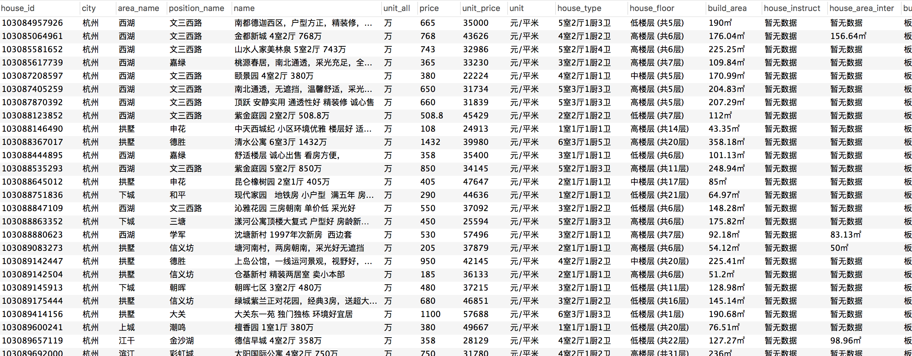

# Lianjia爬虫

链家**二手房**和**成交情况**爬虫, 可以传入城市参数和多个区参数, 如:
```shell
# 爬取北京所有区
python run.py --city=北京 --types=ershoufang

# 爬取海淀和东城区
python run.py --city=北京 --types=ershoufang --areas='海淀|西城'
```

### 步骤
```
# anaconda创建虚拟环境
conda create --name lianjia python=2.7`

source activate lianjia

pip install requirements.txt

```

如果有代理的话去`middlewares/proxy.py`设置代理, 没有的话设置`DOWNLOAD_DELAY`大一点

### 运行步骤





