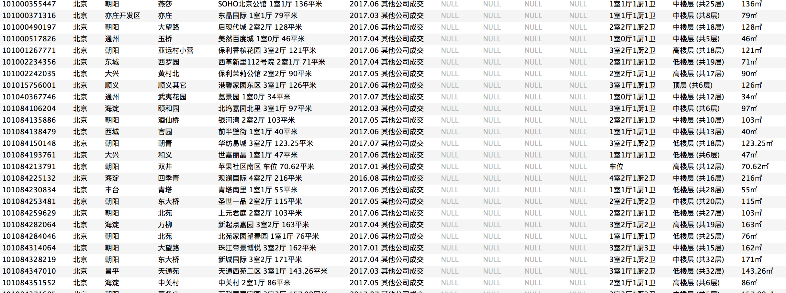

# Lianjia爬虫

链家北京地区**二手房**和**成交情况**爬虫

### 步骤
```
# anaconda创建虚拟环境
conda create --name lianjia python=2.7`

source activate lianjia

pip install requirements.txt

```

如果有代理的话去`middlewares/proxy.py`设置代理, 没有的话设置`DOWNLOAD_DELAY`大一点

### 运行步骤
1. 爬取北京全部地区
注释掉areas

2. 爬取指定地区
设置areas, 用空格隔开, 如`areas = '海淀 东城 西城'`

3. `python run.py`





